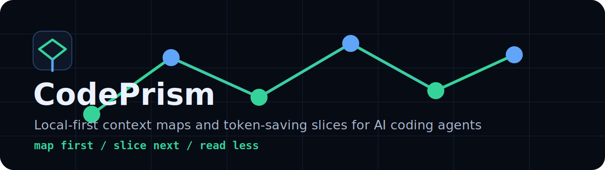

# CodePrism



[](https://github.com/kunolabs/codeprism/actions/workflows/tests.yml)
[](LICENSE)

Local-first context saving for AI coding agents.

CodePrism gives an agent a task-sized map before it reads your code. It scans files, symbols, imports, routes, docs, and hierarchy into a local graph, then writes focused Markdown slices for the work in front of you.

The goal is simple: **map first, slice next, read raw files only when they matter.**


## Quick Commands

```bash
pip install -e ".[dev]"
codeprism setup
codeprism prime "server boot path"
codeprism gain
codeprism mcp --list-tools
```

`codeprism setup` installs Codex/Claude/Copilot helper files and verifies them with `codeprism doctor`. `codeprism prime` maps the repo, writes a focused slice, and prints estimated token savings. `codeprism gain` reports estimated savings again later and warns when the map is stale. `codeprism mcp --list-tools` shows the MCP tools available to agent clients.

The legacy `contextopt` command remains available for existing scripts while the public CLI moves to `codeprism`. Internal Python imports still use the `contextopt` package.

For external or read-only repositories:

```bash
codeprism prime "server boot path" --root PATH_TO_REPO --artifact-dir PATH_TO_ARTIFACTS --readonly-root
```

## Why It Exists

Agents waste context when they brute-read file trees, repeated shell output, generated folders, and source files that are only loosely related to the current task. CodePrism is the local preflight layer: it gives the agent a compact, inspectable starting point so the expensive reasoning window stays focused.

## What It Does

- Builds a local SQLite graph of your repository.
- Extracts deterministic structure from Python, Markdown, JavaScript/TypeScript, and Java files.
- Uses a broad static fallback for common languages such as C/C++, C#, Go, Rust, Ruby, PHP, Kotlin, Swift, shell, PowerShell, and Lua.
- Reuses file hashes so unchanged files are not rescanned.
- Runs `codeprism prime "<task>"` to map the repo and write a targeted slice in one step.
- Caps generated slice Markdown to about 8K estimated tokens by default so the slice itself does not swamp the agent context window.
- Writes a tiny `.brief.md` beside each slice so agents can resume after compaction without reloading the full slice.
- Fetches exact mapped source with `codeprism get <node-id>` so agents can inspect one symbol or file before opening broader code.
- Reads files through token-aware modes with `codeprism read <path> --mode map|signatures|diff|full`.
- Shows graph references with `codeprism references <node-id>`.
- Estimates context size and creates targeted Markdown slices for focused work.
- Reports estimated saved tokens and stale-map status with `codeprism gain`.
- Warns when context-reading commands see a stale map, with `--refresh` and `--strict-fresh` for enforced freshness.
- Serializes map refreshes with an inspectable `context.lock` file so concurrent agents do not rewrite the graph at the same time.
- Provides `codeprism watch` for lightweight polling refresh loops during active multi-agent work.
- Writes local project memory with `codeprism onboard` and `codeprism memory`.
- Produces reproducible savings reports with `codeprism benchmark` and `codeprism benchmark-suite`.
- Routes generated artifacts outside a target repo with `--artifact-dir` and `--readonly-root`.
- Exports Markdown, JSON, DOT, and static browser visualizations.
- Generates stable graph data for tool integration and optional visual inspection.
- Replays JSONL activity streams over the graph with agent markers, trails, timeline controls, and token estimates.
- Writes a lightweight local Live Trace at `.codeprism/live-trace.jsonl` so the viewer can replay CodePrism commands without reading private agent logs.

## Status

CodePrism is alpha software. The current release is meant for local development workflows where you want a smaller, inspectable starting point before handing a codebase to an AI assistant.

The core loop is usable today:

- map a repository into a local SQLite graph
- estimate context size and generate focused slices
- check whether the graph is stale before trusting map output
- keep the graph current with refresh locks and `codeprism watch --once` or a polling watch loop
- expose core context tools through an optional MCP server
- install and verify Codex/Claude/Copilot helpers that nudge agents toward slice-first exploration
- export Markdown, JSON, DOT, and static HTML views
- inspect/search/filter the visual map as a bonus layer
- replay safe JSONL activity events

Token counts are local estimates based on text length. They are useful for comparing full-source, graph, context-pack, and slice sizes, but they are not benchmark claims.

## Early Measurements

These are early local runs on real development repositories. They are meant to show the shape of the workflow, not guarantee identical savings on every project.

| Project shape | Source estimate | CodePrism output | Estimated reduction |
| --- | ---: | ---: | ---: |
| Java server, 1,040 files | ~2.22M tokens | ~80.7K-token context pack | ~96% smaller |
| Android app, 197 files | ~351K tokens | ~77.4K-token focused slice | ~78% smaller |
| Game/tooling repo | ~185K tokens | ~7.5K-token focused slice | ~96% smaller |
| Large agent-tool repo | ~13.2M tokens | ~8K capped focused slice | ~99% smaller |

Actual savings depend on when the agent invokes CodePrism, query scope, file churn, and how much raw source the agent reads outside the map. The best results come from using `codeprism prime` early, then following with targeted `query`, `get`, `references`, and token-aware `read` commands.

To audit whether an agent actually followed that pattern, point CodePrism at a local Codex JSONL session:

```bash
codeprism audit-session SESSION_ID_OR_JSONL --out .codeprism/session-audit.md
```

The audit reports CodePrism command timing, raw reads, search commands, compaction mentions, large outputs, and savings observed in the session. It is local-only and reads a session log only when you explicitly pass one.

To reproduce the public fixture table locally:

```bash
codeprism benchmark-suite examples/benchmarks --out .codeprism/benchmarks/suite.json
```

This writes per-fixture JSON reports plus `.codeprism/benchmarks/suite.md`, a Markdown summary table suitable for release notes or README updates.

Current checked-in fixture suite: 8 Python, TypeScript, Java, and Kotlin fixtures with a 68.75% average estimated source-to-slice reduction. See [docs/benchmarks.md](docs/benchmarks.md) for the full reproducible table and caveats.

## Install From Source

```bash
python -m venv .venv
source .venv/bin/activate   # Windows: .venv\Scripts\activate
pip install -e ".[dev]"
```

MCP support uses the official Python MCP SDK and is optional:

```bash
pip install -e ".[mcp]"
codeprism mcp --list-tools
```

`codeprism init` creates `.codeprism/config.toml` for local settings. Generated `.codeprism/` files are ignored by Git; see `examples/contextopt.config.example.toml` for the default config shape. Existing `.contextopt/` artifact folders are still read as a legacy fallback, but new artifacts use `.codeprism/`.

## Quick Start

```bash
codeprism init
codeprism prime "main"
codeprism visualize --context .codeprism/slices/main.json --outdir .codeprism/visual
```

Read the generated `.codeprism/slices/main.brief.md` before opening broad raw file trees. Open `.codeprism/slices/main.md` only when the brief is insufficient. `codeprism prime` also appends a safe local event to `.codeprism/live-trace.jsonl`; `codeprism visualize` auto-loads that trace when no explicit `--activity` file is supplied. Open `.codeprism/visual/index.html` in a browser when you want the optional graph view.
See [docs/demo.md](docs/demo.md) for the full activity replay and context-overlay walkthrough.

For read-only checkouts or CI jobs, route generated artifacts outside the repository:

```bash
codeprism prime "server boot" --root PATH_TO_REPO --artifact-dir PATH_TO_ARTIFACTS --readonly-root
```

Use a project-specific temp or output directory for `PATH_TO_ARTIFACTS` on Windows, macOS, or Linux.

## Agent Install

Install local helper prompts and skills so Codex, Claude, and Copilot start with CodePrism before broad exploration:

```bash
codeprism setup
codeprism doctor
```

This copies project helpers into `.claude/commands/` and `.github/copilot-instructions.md`, and installs the CodePrism skill into local Codex and Claude skill folders. `codeprism doctor` reports whether those files are installed and current. Restart Codex/Claude after installing global skills.

## Live Trace And Activity Replay

CodePrism records its own command-level events in `.codeprism/live-trace.jsonl`. The trace is local JSONL, uses the same public activity schema, and contains only explicit command metadata such as event type, touched path or node ID, estimated tokens, and slice statistics. Set `CODEPRISM_TRACE=0` to disable writing it.

Generate a viewer from the current local trace:

```bash
codeprism prime "current task" --changed
codeprism visualize --outdir .codeprism/visual
```

CodePrism can also normalize a supplied JSONL event stream and replay touched nodes in the viewer:

```bash
codeprism activity adapt-tool-log examples/tool-events.sample.jsonl --out .codeprism/activity-events.jsonl
codeprism activity normalize examples/activity-stream.sample.jsonl --out .codeprism/activity-stream.json
codeprism visualize --activity examples/activity-stream.sample.jsonl --outdir .codeprism/visual
```

Activity rows can reference `node_id`, `from_node_id`, `to_node_id`, or `path`. Malformed rows are skipped and reported as warnings in the generated activity file.
Optional `estimated_tokens` and `actual_tokens` fields power the replay HUD without requiring CodePrism to read private agent session logs.
The viewer activity panel includes local event search, run/agent filters, jump-to-node, and a touched-only map mode.

## CLI Commands

| Command | Purpose |
| --- | --- |
| `codeprism init` | Create a local `.codeprism/config.toml` file. |
| `codeprism map .` | Scan the repo and update the SQLite graph. |
| `codeprism watch . --once` | Refresh the graph only when the current map is stale. |
| `codeprism watch .` | Poll for changes and refresh the graph with a local map lock. |
| `codeprism export --format md` | Export a Markdown context pack. |
| `codeprism export --format json` | Export stable graph JSON. |
| `codeprism export --format dot` | Export DOT graph data. |
| `codeprism prime "topic"` | Map the repo, write a focused slice plus a small slice brief, and print a savings report. |
| `codeprism prime "topic" --changed` | Seed the slice with changed, staged, and untracked Git files. |
| `codeprism prime "topic" --artifact-dir <dir> --readonly-root` | Write prime artifacts outside the target repo and refuse root writes. |
| `codeprism prime "topic" --max-tokens 6000` | Tighten the generated slice budget for short task loops. |
| `codeprism prime "topic" --allow-large-context --max-tokens 24000` | Explicitly opt into a large slice when the task genuinely needs it. |
| `codeprism visualize --outdir <dir>` | Generate a static browser viewer and auto-load `.codeprism/live-trace.jsonl` when present. |
| `--refresh` | Incrementally refresh the map before a context-consuming command. |
| `--strict-fresh` | Fail when the map is stale instead of warning. |
| `--lock-timeout <seconds>` | Wait for another map refresh before failing with a lock error. |
| `codeprism get <node-id>` | Print exact source for a mapped file, doc, or symbol node. |
| `codeprism references <node-id>` | Show incoming and outgoing graph references for a node. |
| `codeprism read <path> --mode map` | Print mapped nodes for a file without source bodies. |
| `codeprism read <path> --mode signatures` | Print mapped symbols/headings/routes without source bodies. |
| `codeprism read <path> --mode diff` | Print only the working-tree diff for one path. |
| `codeprism read <path> --mode full` | Explicitly print the full file. |
| `codeprism activity adapt-tool-log` | Convert simple safe tool-event JSONL into CodePrism activity JSONL. |
| `codeprism activity normalize` | Normalize safe JSONL activity events into replay JSON. |
| `codeprism query "topic"` | Rank relevant files and symbols. |
| `codeprism stats` | Estimate source, graph, and pack token sizes. |
| `codeprism gain` | Report estimated token savings and map freshness. |
| `codeprism slice <target>` | Export focused Markdown plus a JSON context overlay manifest. |
| `codeprism benchmark <root>` | Write a reproducible local token-savings report. |
| `codeprism benchmark-suite <fixtures>` | Run all local benchmark fixtures and write JSON plus a Markdown table. |
| `codeprism audit-session <session>` | Audit a local Codex JSONL session for CodePrism adoption and context risk. |
| `codeprism onboard` | Write local project memory under `.codeprism/memory/`. |
| `codeprism memory list/read/write` | Manage inspectable local memory files. |
| `codeprism mcp --list-tools` | List optional MCP tools for agent clients. |
| `codeprism setup` | Install and verify agent helper files in one step. |
| `codeprism install-integrations` | Install local Codex/Claude/Copilot helper files. |
| `codeprism doctor` | Check whether installed helper files are present and current. |

## Token-Saving Workflow

Use CodePrism as a preflight step before broad code reading:

```bash
codeprism prime "billing webhook"
codeprism gain
codeprism read src/app.py --mode signatures
codeprism get function::src/app.py::billing_webhook
codeprism references function::src/app.py::billing_webhook
codeprism visualize --context .codeprism/slices/billing-webhook.json --outdir .codeprism/visual
```

That gives an assistant a smaller, inspectable starting point. The prime command maps the repo, writes Markdown for the assistant, writes a JSON manifest for the viewer, and prints source/full-context/slice token estimates plus estimated savings. The gain command repeats the savings report and warns if files changed after the last map. The read command lets an agent inspect file shape before bodies, and the get command uses stable node IDs from slices, query results, or graph JSON to return only the requested source span.

Generated slices are capped to about 8K estimated tokens by default, with a safe ceiling of 16K unless `--allow-large-context` is supplied. Each slice also gets a compact `.brief.md` file for resumes and compacted conversations. If a slice says it was capped, keep the next step narrow: use `codeprism query`, `codeprism get`, `codeprism references`, or `codeprism read --mode signatures/diff` instead of raising the budget reflexively. Do not rerun a broad prime only because the conversation compacted; read the existing brief and continue from its node IDs and paths.

During active edits, seed the slice from Git changes:

```bash
codeprism prime "what I am changing" --changed
```

The assistant should read the slice first, then verify important details in raw source files before editing.

To keep context consistent as the repo evolves, use freshness-aware reads:

```bash
codeprism watch . --once
codeprism read src/app.py --mode signatures --refresh
codeprism get function::src/app.py::billing_webhook --strict-fresh
codeprism visualize --refresh --outdir .codeprism/visual
```

Context-consuming commands warn when the map is stale. Use `--refresh` to incrementally remap before serving context, `codeprism watch . --once` when an agent wants to refresh only if needed, or `--strict-fresh` in CI/agent guardrails to fail instead of reading stale graph state.
Map-writing commands use a local `context.lock` file beside the graph database. If another agent is already refreshing, CodePrism waits up to `--lock-timeout` seconds and exits with code `4` if the lock remains.

For a repository that should not receive generated files, use:

```bash
codeprism prime "what I need" --root PATH_TO_REPO --artifact-dir PATH_TO_ARTIFACTS --readonly-root
```

This writes `context.db`, Markdown slices, and JSON manifests under the artifact directory instead of `.codeprism/` in the target repo.

For an MCP client, install the optional extra and launch the local stdio server:

```bash
pip install -e ".[mcp]"
codeprism mcp --root PATH_TO_REPO
```

The MCP server currently exposes `prime`, `gain`, `query`, `read`, `get`, and `references`. It is intentionally local-first and does not call external APIs.

To create a local project memory file for future agent sessions:

```bash
codeprism onboard --notes "Build/test commands, project purpose, and safety notes."
codeprism memory read project
```

To reproduce token-saving examples:

```bash
codeprism benchmark examples/benchmarks/basic-python --query report --out .codeprism/benchmarks/basic-python.json
```

## Privacy Model

- No network calls are made by default.
- Generated artifacts live under `.codeprism/` by default, or under `--artifact-dir` when supplied.
- Outputs are inspectable text, JSON, DOT, HTML, or SQLite.
- Optional LLM summarization is intentionally out of scope for the default path.

## Project Layout

```text
src/contextopt/        Python package and CLI
src/contextopt/exporters/
src/contextopt/extractors/
apps/brain-viz/       Future browser app scaffold
apps/pixel-brain/     Future replay renderer scaffold
docs/                 Architecture, roadmap, and schemas
examples/             Sample project and activity stream
integrations/         Claude, Codex, and Copilot templates
tests/                Regression tests
```

## Development

```bash
pip install -e ".[dev]"
pytest
ruff check .
codeprism map .
codeprism watch . --once
codeprism export --format json --out .codeprism/context-pack.json
codeprism read README.md --mode signatures
codeprism get "heading::README.md::Quick Start"
codeprism gain
codeprism benchmark-suite examples/benchmarks --out .codeprism/benchmarks/suite.json
codeprism visualize --activity examples/activity-stream.sample.jsonl --outdir .codeprism/visual
codeprism slice main --out .codeprism/slices/main.md
codeprism visualize --context .codeprism/slices/main.json --outdir .codeprism/visual
codeprism setup --target project
codeprism doctor
```

CI runs tests, Ruff, and a CLI smoke path across Python 3.10, 3.11, and 3.12.

## Roadmap

Near-term work is focused on improving slice ranking, adding git-diff-aware context, benchmark fixtures for measured token savings, and deepening static extraction without making the tool heavyweight. Visual polish is still planned, but context savings stay the main product. See `docs/roadmap.md` for the current plan.

## Support

If CodePrism saves you time or tokens, sponsorship helps fund parser coverage, MCP support, reproducible benchmarks, and public docs.

## License

MIT. See `LICENSE`.
