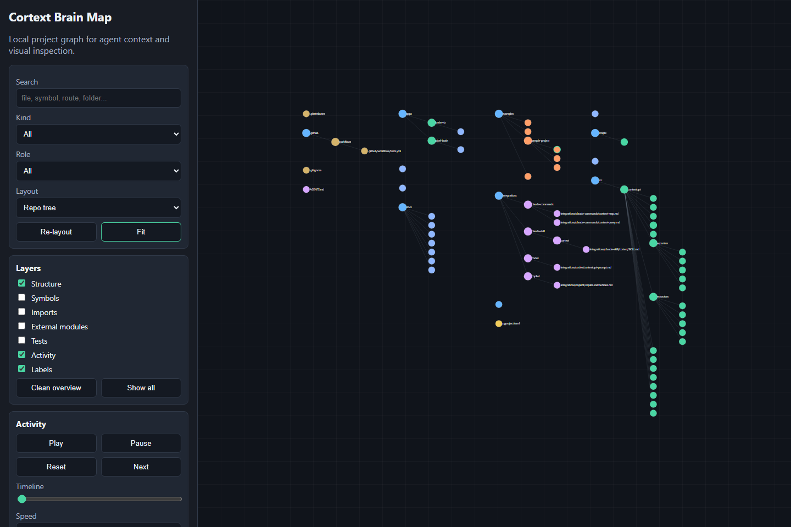

# CodePrism Demo

This walkthrough shows the public context-saving loop for CodePrism on any local repository. The visual map is included as an inspection bonus; the main path is slice-first.

## 1. Install

```bash
python -m venv .venv
source .venv/bin/activate   # Windows: .venv\Scripts\activate
pip install -e ".[dev]"
```

## 2. Prime A Task

```bash
codeprism init
codeprism prime "main"
```

This creates a local `.codeprism/context.db` SQLite graph and a focused `.codeprism/slices/main.md` file. It also appends a small command event to `.codeprism/live-trace.jsonl`, which the viewer can replay later without reading private agent session logs. Generated `.codeprism/` files are local working artifacts and should not be committed.

During an edit session, seed the slice with changed, staged, and untracked Git files:

```bash
codeprism prime "current task" --changed
```

The command prints source, full-context, and slice token estimates plus an estimated saving percentage.

For a read-only checkout or a CI smoke run, keep artifacts outside the target repo:

```bash
codeprism prime "current task" --root PATH_TO_REPO --artifact-dir PATH_TO_ARTIFACTS --readonly-root
```

Replace `PATH_TO_REPO` and `PATH_TO_ARTIFACTS` with normal project and output paths for your machine. With `--readonly-root`, CodePrism refuses to write generated artifacts under `--root`. The Live Trace file follows the same routing: it is written as `PATH_TO_ARTIFACTS/live-trace.jsonl` when `--artifact-dir` is supplied.

## 3. Review Token Estimates

```bash
codeprism stats
codeprism gain
codeprism benchmark examples/benchmarks/basic-python --query report --out .codeprism/benchmarks/basic-python.json
```

The stats command reports local estimated token counts for source, graph, and context-pack outputs. The gain command reports estimated saved tokens and warns if files changed after the latest map. The benchmark command writes a reproducible JSON report for a fixture or target repo. These are estimates for comparison, not benchmark claims.

## 4. Install Agent Helpers

```bash
codeprism setup
codeprism doctor
```

Restart Codex/Claude after installing global skills. The helpers tell agents to run `codeprism prime "<task>"` before broad file reads.

The prime/slice workflow writes:

- `.codeprism/slices/main.md` for an assistant-readable context slice
- `.codeprism/slices/main.json` for the viewer context overlay

Read progressively instead of opening whole files by default:

```bash
codeprism read src/app.py --mode map
codeprism read src/app.py --mode signatures --refresh
codeprism read src/app.py --mode diff
```

Fetch exact source for a mapped node before opening whole files:

```bash
codeprism get function::src/app.py::main
codeprism references function::src/app.py::main
```

Use `--mode full` only when the cheaper map, signatures, diff, slice, or exact node output is insufficient. The get command prints only the mapped source span for that node, with line and token estimate metadata.
Context-consuming commands warn if the map is stale. Use `--refresh` to update incrementally before reading context, or `--strict-fresh` in CI/agent guardrails when stale context should fail.

For durable local handoff notes:

```bash
codeprism onboard --notes "Project purpose, build commands, and safety notes."
codeprism memory read project
```

For MCP-capable clients:

```bash
pip install -e ".[mcp]"
codeprism mcp --list-tools
codeprism mcp --root .
```

## 5. Replay Activity

Replay CodePrism's own local Live Trace:

```bash
codeprism visualize --outdir .codeprism/visual
```

Or normalize supplied safe activity rows:

```bash
codeprism activity adapt-tool-log examples/tool-events.sample.jsonl --out .codeprism/activity-events.jsonl
codeprism activity normalize examples/activity-stream.sample.jsonl --out .codeprism/activity-stream.json
```

The adapter is intentionally simple and safe. It converts explicit tool-event rows into CodePrism activity JSONL. It does not read private agent session logs. To disable CodePrism's own trace writes, set `CODEPRISM_TRACE=0`.

## 6. Open The Optional Viewer

```bash
codeprism visualize \
  --activity examples/activity-stream.sample.jsonl \
  --context .codeprism/slices/main.json \
  --outdir .codeprism/visual
```

Open `.codeprism/visual/index.html` in a browser.

The viewer supports:

- repo-tree and cluster-grid layouts
- search, kind filter, role filter, and layer toggles
- selected-node inspection with incoming/outgoing edges
- Live Trace replay with run/agent filters, touched-only mode, moving markers, and lightweight pulse trails
- context overlays that highlight included slice nodes and show slice-vs-full token estimates

## Screenshot


